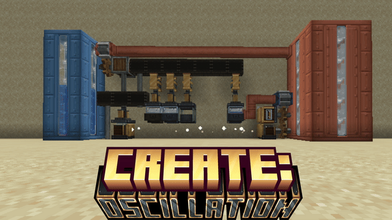

<div align="center">



**Vibration as energy. Gases as a processing medium.**

An addon for [Create](https://github.com/Creators-of-Create/Create) that turns rotation into *frequency* — and frequency into a whole new tier of processing.


</div>

---

## Overview

Create gives you rotation. Oscillation gives you **frequency**. A Resonator turns any shaft into vibration, and how fast it spins decides which of four bands it produces:

| Band | RPM | What opens up |
|:--|:--:|:--|
| **Low** | 32 | Steam, sifting, the first tuned crystal |
| **Mid** | 64 | Quartz Vapour, crystal growth |
| **High** | 128 | Ore slurry, the strongest crystals |
| **Ultrasonic** | 256 | Cavitation, ore multiplication, wireless power at scale |

Recipes declare the band they need, so the same chamber does different things at different speeds — and a fast shaft is not always the right shaft. Gases are real Create fluids: they flow through pipes, sit in tanks, show in JEI, and get carried around in canisters.

Every block has a **Ponder** scene — hover the item and press <kbd>W</kbd>.

For the full walkthrough with clips of each machine, see **[GUIDE.md](GUIDE.md)**.

## The machines

### Andesite age

| | |
|:--|:--|
| **Resonator** | Takes a shaft from above and shakes whatever sits directly below it. Its RPM sets the frequency band. |
| **Resonance Chamber** | A glass-domed basin driven by a Resonator. Runs *resonating* recipes: water → Steam, quartz + water → Quartz Vapour, raw ore → ore slurry, crystal growth… Gases hang under the dome, liquids pool below. |
| **Resonance Pump** | A Mechanical Pump that only moves gases. Liquids stay put. |
| **Condenser** | Passive, resizable up to 3×3. Turns gases back into liquids and solids — steam to water, quartz vapour to quartz, metal vapour to concentrate. Warms up after the first conversion and keeps going while fed. |
| **Vent** | Voids any gas piped into it, with a plume. Refuses liquids. |
| **Gas Canister** | 1000 mb bucket for gases. Tinted by its contents; one JEI entry per gas. |
| **Vibrating Sieve** | Sits under a Resonator. Gravel, sand, red sand and soul sand shake down into flint, nuggets and more. |

### Brass age

| | |
|:--|:--|
| **Tuned Crystals** | Grown in the Chamber tier by tier, each at its own band: Rough Quartz Crystal + nether quartz → **Low** · + rose quartz → **Mid** · + amethyst → **High** · + powdered obsidian → **Ultrasonic**. Rough crystals come from condensing Quartz Vapour. |
| **Tuning Fork** | A shaft relay that hands rotation downward at *exactly* its chosen band's speed. One fast shaft, several machines, each at the band it needs. |
| **Resonance Emitter & Receiver** | Matching crystals in both, aimed at each other through open air, and rotation crosses the gap. Capacity scales with the crystal — an Ultrasonic link carries an entire build. Anything solid breaks the beam. |
| **Cavitation Chamber** | The Ultrasonic step of ore processing: ore slurry + steam → metal vapour. |
| **Sonic Pulveriser** | A Resonator turned sideways. Burns a crystal as fuel and shatters a whole layer of blocks in front of it — 1×1 up to 7×7, deeper with higher tiers. Takes a Create filter, rides contraptions, and can be fed by hoppers and funnels. |

### Ore multiplication — 2.5 ingots per raw ore

```
raw ore + water  ──High──▶  ore slurry  ──Ultrasonic──▶  metal vapour  ──Condenser──▶  2 concentrate + 50% a third  ──▶  smelt
     Resonance Chamber          Cavitation Chamber                                    Furnace / Blast Furnace
```

Iron, gold, copper and zinc are built in, matched by `c:raw_materials/*` tags so other mods' ores of those metals work too.

## For pack makers: adding a metal

The ore chain is data driven — no code needed.

1. Map the raw ore in the data map `data/<ns>/data_maps/item/createoscillation/metals.json`:
   ```json
   { "values": { "somemod:raw_tin": { "metal": "tin", "colour": "#C8D0D8" } } }
   ```
2. Copy the iron recipes from `data/createoscillation/recipe/` — `resonating/slurry_iron`, `cavitating/vapour_iron`, `condensing/concentrate_iron`, `crafting/smelting/ingot_iron` and `blasting/ingot_iron` — and replace `iron` with `tin`. Ingredients that must match a metal use `neoforge:components` with `createoscillation:metal`.
3. Optionally add lang `createoscillation.metal.tin` = `Tin` (it falls back to a capitalised id).

Slurry, vapour, concentrate and canisters pick up the new metal's name and colour automatically, including in JEI.

## Compatibility

- **Create 6.0.11+** — required. Registrate, Ponder and Flywheel come with it.
- **JEI** — optional; categories for Resonating, Cavitating, Condensing and Sifting, with the band each recipe needs.
- **Jade** — supported in the dev environment.

## Building from source

```
./gradlew build              # jar into build/libs
./gradlew runClient          # dev client with Create, JEI and Jade
./gradlew runData            # datagen into src/generated/resources
./gradlew runGameTestServer  # headless gametests
./gradlew runShowcase        # replays run/showcase/shots.json in the "showcase" world and saves frames (see tools/shots.example.json)
python tools/showcase_gifs.py  # turns those frames into media/ponder/*.gif and a contact sheet
```

Versions live in `gradle.properties`.

## Credits & license

Create: Oscillation is released under the [MIT License](LICENSE).

Several textures are recoloured from Create's (MIT), and the Resonance Pump reuses Create's mechanical pump geometry — thank you to the Creators of Create.
